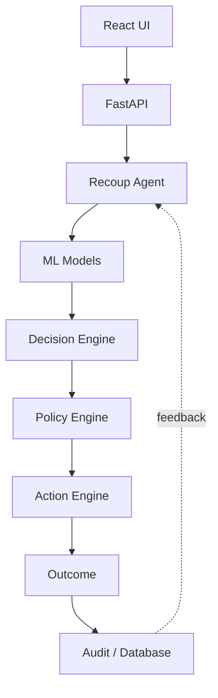

<div align="center">
 
# Recoup
 
**Adaptive AI Revenue Recovery Agent**
 
[]()
[]()
[]()
[]()
[]()
[]()
 
Recoup decides **whether, what, and when** to do about a failed payment — and explains why.
</div>
 
---
 
## Table of Contents
 
- [The Problem](#the-problem)
- [Our Solution](#our-solution)
- [What Makes Recoup Different](#what-makes-recoup-different)
- [MVP — What We Actually Built](#mvp--what-we-actually-built)
- [How the App Works](#how-the-app-works)
- [Agent Architecture](#agent-architecture)
- [Machine Learning](#machine-learning)
- [Decision Engine](#decision-engine)
- [Failure-Aware Strategy](#failure-aware-strategy)
- [Policy Engine / Guardrails](#policy-engine--guardrails)
- [Agentic Behavior](#agentic-behavior)
- [Benchmark Results](#benchmark-results)
- [Example Agent Decision](#example-agent-decision)
- [Technology Stack](#technology-stack)
- [API / Backend](#api--backend)
- [Project Structure](#project-structure)
- [Local Setup](#local-setup)
- [Deployment](#deployment)
- [Limitations & Future Work](#limitations--future-work)
- [Security / Responsible Design](#security--responsible-design)
- [Demo Flow](#demo-flow)
- [Final Value Proposition](#final-value-proposition)
---
 
## The Problem
 
Failed payments are usually treated as a plumbing problem: *"a charge didn't go through, so retry it."* But every failed payment is really a small, underspecified decision problem, and most recovery systems answer it with one fixed rule for every customer:
 
```
Payment Failed
  → Wait fixed time
  → Retry
  → Retry again
```
 
This ignores that customers, failure reasons, and timing are not interchangeable. A fixed-delay retry strategy tends to produce:
 
- **Unnecessary retries** — retrying payments that were never going to succeed
- **Poor timing** — retrying before the customer's actual constraint (e.g. low balance) has resolved
- **Customer fatigue** — repeated charge attempts and notifications that erode trust
- **Wasted recovery attempts** — spending retry/contact budget on low-value cases
- **Failure-blindness** — treating `INSUFFICIENT_FUNDS`, `BANK_ERROR`, and `MANDATE_FAILURE` identically
- **The wrong optimization target** — maximizing "did the retry fire" instead of *actual recovered revenue*
This leads to the real problem statement:
 
> **How can an intelligent recovery system determine (1) whether recovery should be attempted, (2) what recovery action should be taken, (3) when that action should happen, (4) whether the action is economically worthwhile, and (5) what to do next if recovery fails?**
 
Everything in Recoup is built to answer these five questions — per payment, not per system-wide rule.
 
---
 
## Our Solution
 
**Recoup is an adaptive AI revenue recovery agent that learns when a customer is most likely to pay, and chooses whether, when, and how to recover a failed payment.**
 
Recoup is **not** just a prediction model, and it is **not** just a retry scheduler. It is a small closed-loop system where each component has one job:
 
| Component | Responsibility |
|---|---|
| **ML Model** | Predicts recovery probability |
| **Decision Engine** | Optimizes expected recovered revenue across actions and timing |
| **Policy Engine** | Enforces deterministic safety limits |
| **Agent** | Executes the approved action |
| **Outcome Observer** | Records what actually happened |
| **Audit Trail** | Logs every decision, probability, and outcome |
 
> **ML predicts. Decision Engine optimizes. Policy Engine controls. Agent acts. Outcome feeds the next decision. Audit Trail records everything.**
 
---
 
## What Makes Recoup Different
 
**Traditional recovery:**
```
Payment Failed → Fixed delay → Retry
```
 
**Recoup:**
```
Payment Failed
  → Understand failure
  → Analyze customer/payment context
  → Generate multiple recovery strategies
  → Predict success probability
  → Evaluate expected monetary value
  → Select action + timing
  → Apply safety policies
  → Execute
  → Observe outcome
  → Replan
  → Stop when recovery is no longer justified
```
 
### A. What *and* When
Most systems only decide *whether* to retry. Recoup jointly optimizes the **action** and the **timing window** for that action.
 
### B. Action Selection
The agent chooses from a fixed action set:
 
| Action | Description |
|---|---|
| `SMART_RETRY` | Re-attempt the original payment method |
| `PAYMENT_LINK` | Send an alternate payment link |
| `NUDGE` | Send a reminder/notification, no charge attempt |
| `STOP` | No further recovery action is justified |
 
### C. Failure-Aware Recovery
Recoup distinguishes between failure classes — `INSUFFICIENT_FUNDS`, `BANK_ERROR`, `MANDATE_FAILURE`, `UNKNOWN` — because the right recovery approach is not the same for a bounced mandate as it is for a low-balance card.
 
### D. Revenue-Aware Decision Making
Recoup optimizes **expected monetary value**, not raw success probability:
 
```
Expected Recovery = (Payment Amount × Recovery Probability) − Action Cost
```
 
The action most *likely* to succeed is not always the action that produces the highest *expected recovered revenue* once cost is factored in — a cheap nudge with moderate probability can outperform an expensive retry with slightly higher probability.
 
### E. Agentic Closed Loop
```
Observe → Reason → Act → Observe → Replan → Stop
```
 
### F. Safety by Design
The ML model can *recommend*, but it cannot *authorize*. Every recommended action is checked against deterministic policy limits before execution.
 
### G. Auditability
Every probability, timing candidate, selected action, policy outcome, and recovery result is written to an audit log — nothing is decided silently.
 
---
 
## MVP — What We Actually Built
 
Recoup's MVP demonstrates the **complete recovery loop end-to-end** — it is a working decision system evaluated in a synthetic environment, not a production payment processor.
 
### 1. Authentication
- Supabase authentication (email/password + Google OAuth)
- Profile onboarding step for incomplete Google profiles
### 2. Demo Checkout
- Simulated checkout flow where a user enters a payment amount
- Payment failure can be triggered on demand, with a selectable failure reason
- The failed payment is sent to the backend for recovery
### 3. Recovery Operations Dashboard
- Lists failed payments with customer/payment context
- Lets an operator trigger the Recoup agent on a given payment
### 4. Recoup Agent
- Receives a failed payment
- Loads the trained ML model
- Evaluates candidate recovery strategies and timing windows
- Selects the best action + timing
- Routes the decision through the Policy Engine
- Executes the recovery action and records the outcome
### 5. Agent Decisions View
Shows, per payment: selected action, timing, recovery probability, expected recovery, policy result, and final outcome.
 
### 6. Audit Trail
Full structured log per decision: timestamp, payment ID, customer ID, amount, failure reason, action probabilities, selected action + probability, expected recovery, timing, attempt number, policy decision, outcome, and recovered amount.
 
### 7. Evaluation / Performance Dashboard
Side-by-side comparison of **Baseline**, **ML-powered recovery**, and **Agentic Recoup** across recovery rate, recovered revenue, average attempts, and uplift.
 
### 8. Profile
Personal info, merchant info, account info, and authentication/security settings.
 
> Recoup's MVP demonstrates the *complete recovery decision loop*, not a production payment processing platform.
 
---
 
## How the App Works
 
```
Demo Checkout
  → Payment Failure
  → Recovery Operations
  → Recoup Agent
  → ML Predictions
  → Candidate Strategies
  → Decision Engine
  → Policy Engine
  → Action Engine
  → Outcome
  → Audit Trail
```
 
1. **Demo Checkout** — a user simulates a payment and can force a failure with a specific reason.
2. **Recovery Operations** — the failed payment appears in the operations dashboard.
3. **Recoup Agent** — pulls the payment/customer context and the trained model.
4. **ML Predictions** — the model scores recovery probability across candidate actions and timing windows.
5. **Candidate Strategies** — a full set of (action, timing) pairs is generated.
6. **Decision Engine** — computes expected recovery for each candidate and ranks them.
7. **Policy Engine** — checks the top candidate against deterministic guardrails.
8. **Action Engine** — executes the approved action.
9. **Outcome** — the result (recovered / not recovered) is captured.
10. **Audit Trail** — the full decision record is persisted for review.
---
 
## Agent Architecture
 

 
| Layer | Role |
|---|---|
| **React UI** | Operator-facing dashboard and demo checkout |
| **FastAPI** | Stateless API layer between UI and agent |
| **Recoup Agent** | Orchestrates the recovery decision for a payment |
| **ML Models** | Score recovery probability per candidate strategy |
| **Decision Engine** | Selects the action/timing with the best expected value |
| **Policy Engine** | Enforces hard safety limits, independent of the model |
| **Action Engine** | Executes the approved action |
| **Audit / Database** | Persists every decision and outcome |
 
Prediction, decision-making, policy enforcement, execution, and auditing are deliberately kept as **separate stages** rather than one monolithic "AI decides everything" function. This separation means:
 
- A bad model prediction can never bypass policy limits
- Each stage can be tested, replaced, or audited independently
- Every action taken has a traceable, inspectable justification
---
 
## Machine Learning
 
### Dataset
 
| Property | Value |
|---|---|
| Customers | 1,000 |
| Payments per customer | 20 |
| Total payments | 20,000 |
| Successful | 16,978 |
| Failed | 3,022 |
| Success rate | ~85% |
| Random seed | 42 |
| Payment methods | UPI, CARD, NETBANKING, WALLET |
| Behavioral patterns | Weekly / biweekly / monthly cadences, preferred payment method per customer |
 
### Recovery Training Data
 
| Property | Value |
|---|---|
| Total examples | 72,510 |
| Recovered | 18,030 |
| Not recovered | 54,480 |
 
### Model
 
**Random Forest Classifier**
 
| Hyperparameter | Value |
|---|---|
| Trees | 200 |
| Max depth | 12 |
| Class weighting | Balanced |
| Categorical features | One-hot encoded |
| Numerical features | Used as-is |
 
### Evaluation
 
| Metric | Score |
|---|---|
| Accuracy | 65.34% |
| Precision | 38.06% |
| Recall | 62.73% |
| ROC-AUC | 69.13% |
 
The model outputs a **recovery probability** for a given (payment, action, timing) candidate. It does not decide, on its own, whether an action executes — that decision belongs to the Decision Engine and Policy Engine downstream.
 
---
 
## Decision Engine
 
The Decision Engine evaluates candidate strategies jointly across **action** and **timing**.
 
**Actions:** `SMART_RETRY`, `PAYMENT_LINK`, `NUDGE`, `STOP`
 
**Timing candidates:** `+1h`, `+6h`, `+12h`, `+24h`, `+48h` (and other evaluated windows as implemented)
 
**Action costs:**
 
| Action | Cost |
|---|---|
| `SMART_RETRY` | 0.50 |
| `PAYMENT_LINK` | 1.00 |
| `NUDGE` | 0.20 |
 
**Formula:**
 
```
Expected Recovery = (Amount × Probability) − Action Cost
```
 
For every failed payment, the engine scores all valid (action, timing) candidates and selects the one with the highest expected recovery that also satisfies policy constraints — not simply the one with the highest raw probability.
 
---
 
## Failure-Aware Strategy
 
Different failure classes are associated with different preferred recovery actions. These preference scores are **heuristic priors used alongside the ML probability**, not claims of a learned causal relationship.
 
| Failure Reason | SMART_RETRY | PAYMENT_LINK | NUDGE |
|---|---|---|---|
| `BANK_ERROR` | 1.00 | 0.65 | 0.45 |
| `INSUFFICIENT_FUNDS` | 0.75 | 0.65 | 1.00 |
| `MANDATE_FAILURE` | 0.35 | 1.00 | 0.55 |
| `UNKNOWN` | 0.45 | 0.55 | 0.40 |
 
Intuition: a bank-side error is often transient and worth retrying directly; a bounced mandate usually needs a fresh payment link rather than repeating the same failed instruction; low funds often benefit from a delayed nudge rather than an immediate retry.
 
---
 
## Policy Engine / Guardrails
 
The Policy Engine is fully **deterministic** and sits between the model's recommendation and execution.
 
| Guardrail | Limit |
|---|---|
| Maximum retries | 2 |
| Maximum automated nudges/contacts | 2 |
| Cooldown between actions | 6 hours |
| Maximum recovery window | 7 days |
 
```
AI recommends → Policy Engine validates → Only allowed actions execute
```
 
The AI cannot override these constraints. If the Decision Engine's top candidate violates a guardrail, the Policy Engine either selects the next valid candidate or returns `STOP`.
 
---
 
## Agentic Behavior
 
Recoup follows a closed observe–reason–act loop rather than firing a single stateless prediction:
 
```
OBSERVE → REASON → ACT → OBSERVE → REPLAN → STOP
```
 
If an attempted action does not result in recovery, the agent re-evaluates whether a *different* action is justified, rather than mechanically repeating the same one. Recovery stops once no remaining candidate has a policy-valid, positive expected value.
 
**Transparency note:** the current training dataset is dominated by first-attempt examples. Multi-step ("second action") agentic behavior is demonstrated and evaluated through the recovery simulator / evaluation environment described below, rather than being learned end-to-end from multi-step real-world data.
 
---
 
## Benchmark Results
 
> All figures below come from a **synthetic evaluation environment**, not production Razorpay transactions.
 
| Strategy | Recovery Rate | Recovered Revenue | Avg. Attempts |
|---|---|---|---|
| Baseline (fixed retry) | 38.84% | ₹597,783.55 | 1.69 |
| ML-powered recovery | 66.61% | ₹1,075,704.97 | 1.00 |
| **Agentic Recoup** | **85.12%** | **₹1,387,407.84** | 1.25 |
 
Additional agentic detail: **151** second actions taken, **0** policy blocks triggered.
 
**Improvement over baseline:**
 
| Metric | Value |
|---|---|
| Additional recovered revenue | ₹789,624.29 |
| Recovery rate uplift | +46.28 percentage points |
| Relative improvement | +132.09% |
 
---
 
## Example Agent Decision
 
```
Payment ID:        PAY_008809
Customer ID:        CUST_00441
Amount:             ₹739.29
Failure reason:      UNKNOWN
Candidates evaluated: 15
 
Selected action:     PAYMENT_LINK
Timing:              +48 hours
Probability:         37.87%
Expected recovery:   ₹278.99
Policy result:        Allowed
Outcome:              NOT_RECOVERED
Recovered amount:     ₹0.00
```
 
This is a real trace shape from the evaluation environment where recovery ultimately failed. It's included deliberately: **a failed outcome does not mean the decision was invalid.** Recoup should be judged on decision quality and aggregate recovery outcomes across the whole payment population, not on any single case.
 
---
 
## Technology Stack
 
| Layer | Technologies |
|---|---|
| **Frontend** | React, Vite, React Router, Lucide React |
| **Backend** | Python, FastAPI, Uvicorn |
| **Machine Learning** | Python, scikit-learn, Random Forest, Joblib |
| **Authentication** | Supabase (Email/Password, Google OAuth) |
| **Deployment** | Vercel (frontend), Render (backend) |
| **Data** | Synthetic CSV datasets, structured audit logs |
 
---
 
## API / Backend
 
| Endpoint | Method | Description |
|---|---|---|
| `/` | GET | Basic service root/info |
| `/api/health` | GET | Health check for the backend service |
| `/api/payments` | GET | Lists payments (including failed ones) |
| `/api/audit` | GET | Retrieves the full audit trail |
| `/api/audit/recent` | GET | Retrieves the most recent audit entries |
| `/api/evaluation` | GET | Returns baseline vs. ML vs. agentic benchmark metrics |
| `/api/summary` | GET | Returns summary statistics across payments/recoveries |
| `/api/recover/{payment_id}` | POST | Triggers the Recoup agent to evaluate and act on a payment |
| `/api/payments/mock-failure` | POST | Simulates a failed payment for demo purposes |
 
---
 
## Project Structure
 
```
recoup/
├── backend/
│   ├── main.py               # FastAPI app entrypoint
│   ├── agent/                # Recoup agent orchestration
│   ├── ml/                   # Model training + inference
│   ├── decision_engine/       # Expected value scoring
│   ├── policy_engine/         # Deterministic guardrails
│   ├── audit/                 # Audit trail persistence
│   └── data/                  # Synthetic datasets
├── frontend/
│   ├── src/
│   │   ├── pages/             # Dashboard, checkout, audit, evaluation views
│   │   ├── components/
│   │   └── App.jsx
│   ├── package.json
│   └── vite.config.js
└── README.md
```
 
---
 
## Local Setup
 
### Backend
 
```bash
python -m uvicorn backend.main:app --reload --host 127.0.0.1 --port 8000
```
 
### Frontend
 
```bash
cd frontend
npm install
npm run dev
```
 
### Environment Variables
 
The frontend and backend require Supabase credentials for authentication (URL and anon/public key). These should be provided via a local `.env` file that is **not** committed to the repository.
 
---
 
## Deployment
 
- **Frontend** → deployed on **Vercel**
- **Backend** → deployed on **Render**
The deployed frontend communicates with the deployed FastAPI backend over HTTPS. No API keys or secrets are committed to source control; all credentials are supplied via environment variables in each platform's configuration.
 
---
 
## Limitations & Future Work
 
### Current Limitations
 
- Evaluated entirely in a **synthetic environment** — no claim of production payment recovery
- The recovery simulator, not live transaction data, is used for benchmarking
- Training data is dominated by first-attempt examples; multi-step ("attempt 2+") behavior is demonstrated via the agentic simulation rather than learned end-to-end
- Payment execution is **represented** within the MVP rather than being a live production payment recovery system
### Future Possibilities
 
- Real payment gateway integration
- Online learning from real recovery outcomes
- More sophisticated customer-level behavioral models
- Contextual bandits / reinforcement learning for action selection
- Integration with real notification providers
- Additional/finer-grained failure classifications
- Real-time payment event streams
- Merchant-level optimization
- Structured experimentation / A-B testing framework
None of the above are implemented in the current MVP.
 
---
 
## Security / Responsible Design
 
- **Deterministic policy enforcement** — the ML model cannot bypass guardrails
- **Authentication** via Supabase (email/password + Google OAuth)
- **Complete audit logs** for every decision and outcome
- **No secrets committed to GitHub** — credentials are environment-variable based
- **Separation of concerns** between AI recommendation and policy enforcement
- **Synthetic data** used throughout evaluation — no real customer payment data involved
---
 
## Demo Flow
 
A five-minute walkthrough for judges/reviewers:
 
1. Log in
2. Open Demo Checkout
3. Simulate a payment failure (pick a failure reason)
4. Open Recovery Operations
5. Trigger the Recoup agent
6. Show the candidate actions considered
7. Show the selected action + timing
8. Show the Policy Engine's validation
9. Show the recovery outcome
10. Open the Audit Trail for that decision
11. Show the benchmark results (baseline vs. ML vs. agentic)
12. Walk through the architecture and explain the differentiation
---
 
## Final Value Proposition
 
Recoup transforms payment recovery from a fixed retry workflow into an adaptive decision system.
 
Instead of blindly retrying failed payments, Recoup determines:
 
- **WHAT** action to take
- **WHEN** to take it
- **WHY** it is economically valuable
- **WHETHER** policy allows it
- **WHAT** to do next
The core innovation is the combination of **ML prediction + economic decisioning + agentic execution + deterministic guardrails + complete auditability** — a recovery system that reasons about each failed payment on its own terms, and can explain exactly why it acted the way it did.
 
